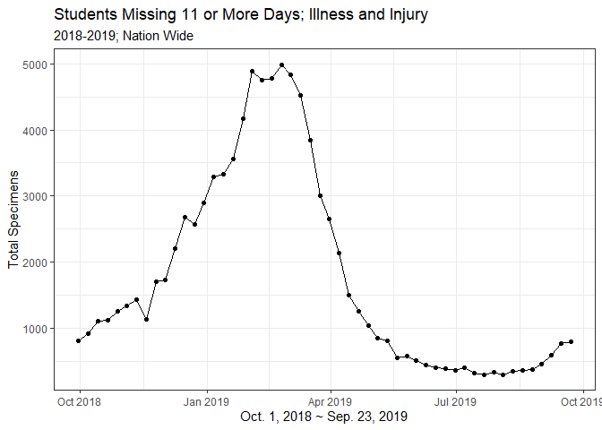
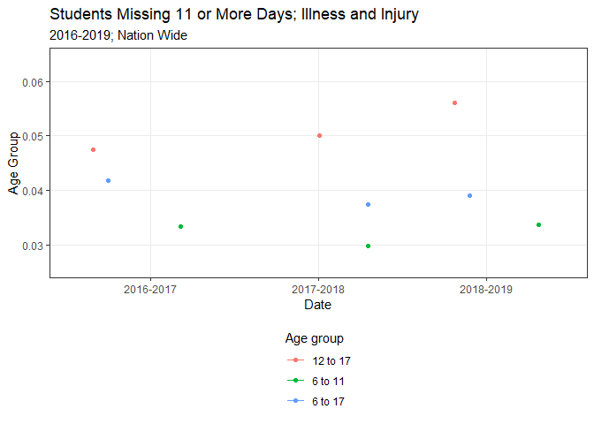

## Title

The Impact on Education Due to SARS-CoV-2 in 2020 - 2021 Versus the
Impact on Education Due to Influenza in 2018-2019

## Author

Allyson Godel

## Author Affiliations

Dr. Merkord

## Introduction

> As SARS-CoV-2 began its tyranny throughout the world, many variables
> of everyone’s life were altered in order to battle this change. Along
> with excessive hand washing, toilet paper hoarding, and Zoom stocks
> skyrocketing, how education was given and received was altered in both
> good and bad ways during this panic. Using the comparison of positive
> tests regarding both SARS-CoV-2 and Influenza in 2018-2019 allows us
> to visually observe the differences in how these viruses caused change
> throughout the education system.

## Methods

    Websites used:

<https://gis.cdc.gov/> In order to get to the Influenza data set, a
simple “Influenza” search in the top right search bar will result in
several data sets. The data set titled “Data Visualization and
Interactive Mapping for Flu Surveillance \| Place and Health” will be
where we find our data sets. Once this link is clicked, a web page
explaining the Flu Mapping tool will lead you to the “FluView
Interactive” tool, which is located under the heading “Interactive Flu
Surveillance. Once this link is clicked, we can simply follow the prompt
to”view both influenza laboratory data and medically attend visits for
influenza-like illness…“. Once on this interactive page, we specify
our”Season” as 2018-2019, then observe the data produced on the “Stacked
Column Chart WHO/NREVSS”. This data set allows us to see who was
previously affected by influenza in the year 2018-2019.

<https://datacenter.kidscount.org/> By selecting “View U.S. Data”, you
will be able to view any data presented on this website. By specifying
and clicking “COVID-19” under the “Special Topics”, you are able to
scroll down and find the “Education Indicators” topic, which will house
our data set under the “School Age” section. We are able to open the
data set “Change in how households with children received education due
to the SARS-CoV-2 pandemic”, which houses a portion of the data set
used. By selecting “View U.S. Data”, you will be able to view any data
presented on this website. By specifying and clicking “Education” under
the “Topics” tab, you are able to scroll down and find the “School Age”
topic, which will house our data set under the “Children who missed 11
or more days of school per year due to illness or injury”.
Specifications of year can be made. In this case, 2018-2019 was viewed
and used in this data set. <https://covidtracking.com/data/download>
This website allows you to download specific state information regarding
trends during the SARS-CoV-2 pandemic. For this research, we will be
using the “summary data for the United States”, which can be downloaded
directly under the “National data” heading.

## Results

After selecting the data necessary to make an assessment, not only was
there an increase in absences during the height of Influenza, but an
increase in altered education before, during, and after the SAR-CoV-2
pandemic.

> S - Estimates suppressed when the 95% confidence interval is greater
> than 20 percentage points or 1.2 times the estimate. N.A. – Data not
> available. Percentages exclude missing data. Weighted percentages were
> applied to the estimates of those missing to derive overall estimates
> for the number of children.

<!-- -->

    ## geom_path: Each group consists of only one observation. Do you need to adjust
    ## the group aesthetic?

<!-- -->

> S - Estimates suppressed when the effective sample size is less than
> 30 or the 90% confidence interval is greater than 30 percentage points
> or 1.3 times the estimate

## Discussion

> After observing the graphs representing the influenza increase and 11
> or more days missed, we are able to come to conclude there was an
> increase in percent of students who missed school due to injury or
> illness. Observing the age group “6-12”, we are able to notice a vast
> increase in percent around the same time period of an increase in
> influenza results. Although this increase is noted, it does not hold
> the same immense amount of increase of education delay the SARS-CoV-2
> pandemic held upon the distribution of education.

> When observing the increase in positive results regarding COVID, we
> can observe an increase in education using online resources. This use
> of online resources and paper materials was highest at the beginning,
> died down, then increased once again with the introduction of a second
> variant of the virus. As we observe these graphs around the beginning
> of October (the beginning of the second variant), we are able to
> observe an overall increase in online and paper material being used in
> schools. At that time, many school districts were also taking action
> by socially distancing their students, canceling classes such as
> physical education, and requiring a mask mandate. This defense plays
> into the last two graphs, which represents the overall change and
> operation of education systems after these changes were implemented
> (remaining and enforcing these defensive tactics to avoid the virus).

> Overall, these graphs both represent the education system and how
> affected it becomes on impact of viruses in general, however also
> represents the immense amount of safety put into the system.
> Throughout this pandemic, education systems have remained vigilant and
> continue to fight for childrens rights to remain educated.

## References

    Centers for Disease Control and Prevention. (n.d.). National, regional, and state level outpatient illness and viral surveillance. Centers for Disease Control and Prevention. Retrieved April 3, 2022, from https://gis.cdc.gov/grasp/fluview/fluportaldashboard.html 

    Data download. The COVID Tracking Project. (n.d.). Retrieved April 3, 2022, from https://covidtracking.com/data/download 

    Children who missed 11 or more days of school per year due to illness or injury: Kids Count Data Center. KIDS COUNT data center: A project of the Annie E. Casey Foundation. (n.d.). Retrieved April 3, 2022, from https://datacenter.kidscount.org/data/tables/9714-children-who-missed-11-or-more-days-of-school-per-year-due-to-illness-or-injury?loc=1&loct=1#detailed/1/any/false/1696,1648,1603/18,691,30/18960 

    Change in how households with children received education due to the coronavirus pandemic: Kids Count Data Center. Change in how households with children received education due to the coronavirus pandemic | KIDS COUNT Data Center. (n.d.). Retrieved April 3, 2022, from https://datacenter.kidscount.org/data/map/10883-change-in-how-households-with-children-received-education-due-to-the-coronavirus-pandemic?loc=24&clean=true

## Acknowledgements

Chris Merkord, PhD Associate Professor
